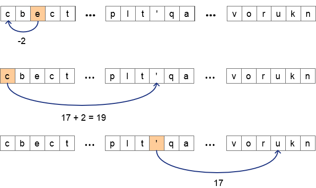

# S2P-0802-OEFENING-03

Voor deze opdracht moet je toch een beetje Indiana Jones bloed in je hebben.  Je gaat op zoek naar de boodschap van Brian.  Brian heeft namelijk zijn boodschap in een tekst verborgen.  Het is jou taak om deze boodschap te ontcijferen...

---

Voor deze oefening maak je gebruik van het tekstbestand 'boodschap.txt'.  'boodschap.txt' bevat maar liefst 10000 karakters.  In deze tekst zit bericht verscholen, aan jou om deze te ontcijferen.

Maak een Python-script waarmee je het verscholen bericht ontcijfert en wegschrijft naar het tekstbestand `titel.txt`.

Aan de hand van elk karakter, teken die je van de boodschap in de tekst vindt, kan je het volgende karakter of teken in de tekst als volgt afleiden:

- is het karakter die je gevonden hebt een klinker, dan moet je het volgende karakter links van de klinker vinden.  Het aantal posities naar links komt overeen met de positie van de klinker in de lijst met klinkers.  Zo bijvoorbeeld, het volgende teken dat op klinker a volgt staat 1 positie naar links van a (a staat op de eerste positie in de lijst met klinkers).  e staat op de tweede positie, wat betekent dat je het volgende teken twee posities naar links van e moet zoeken, i staat op de derde positie, dus moet je drie posities naar links, en zo verder... 
- heb je een medeklinker of een ander teken gevonden (geen klinker) dan moet je het volgende teken minstens 17 posities naar rechts zoeken.   
  Voor een medeklinker vermeerder je 17 met de plaats van de medeklinker in de lijst met medeklinkers,   Zo bijvoorbeeld, heb je medeklinker c gevonden (staat op de tweede plaats in de lijst met medeklinkers) vermeerder je 17 met 2, met andere woorden het volgende teken staat op 19 karakters rechts van van het huidige karakter.  
  Voor elk ander gevonden teken (geen kinker of medekliner) vind je het volgende karakter van de boodschap op 17 karakters naar rechts.

Het onderstaande schema illustreert deze werkwijze.



Het eerste karakter is het 23ste teken in de boodschap.  Wanneer je een asterisk * in de boodschap tegenkomt, dan heb je in principe alle karakters waaruit de boodschap bestaat, gevonden en heb je bijgevolg de boodschap van Brian ontcijferd.  Kom je de asterisk in de boodschap niet tegen, dan ben je fout bezig ! De asterisk zelf maakt geen deel meer uit van de boodschap.  Het duidt alleen het einde van de boodschap aan.

Een handige functie die je in de zoektocht naar de geheime boodschap kan helpen is de functie **index()**. 

Met behulp van deze functie vraag je de positie op van het eerste voorkomen van het opgegeven karakter teken in de string.  We illustreren deze functie aan de hand van volgend voorbeeld.

De variabele *letters* bevat de string *azerty*. We willen de positie van het karakter teken 'e' in azerty vinden.

```python
letters = 'azerty'  
ndx = letters.index('e')  
print(ndx)
```

levert 2 op (positie a is 0, positie z is 1 en ten slotte positie e is 2)

Bedenk dat de geheime boodschap die Brian je toestuurt des te meer van toepassing is als je veel moeite hebt moeten doen om de boodschap te ontcijferen !

Geef de voorkeur aan  een korte, efficiënte script, misschien als tweede of derde versie ! Maak gebruik van de string-functies en wees uiterst spaarzaam met if-statements.
